# GamjaMarket
Web Project : Gamja-Market
notion : <a href="https://www.notion.so/2a09a64f2f8d4b9e84c6d280adbe5d38?v=306404e77898486b9cc1a008133971f9">노션 보러가기</a>
site : http://gamja-market.site(현재 사용 중지)

#### 프로젝트 소개

**감자마켓**은 여러분의 주변 이웃들과 손쉽게 중고 거래를 할 수 있는 편리한 사이트입니다.

🌐 지도 기능을 활용한 근처 매물 확인: 지도를 통해 주변 중고 매물을 한 눈에 확인하세요. 현재 지역 또는 관심 있는 지역을 선택하고, 다양한 카테고리의 상품들을 탐색해보세요.

📷 상품 등록 및 게시물 작성: 자신이 판매하고자 하는 중고 물품을 손쉽게 등록하고, 상세한 설명과 사진을 추가해보세요.

💬 댓글 및 1:1 채팅 기능을 통한 소통: 마음에 드는 상품을 발견했다면 댓글이나 1:1 채팅으로 판매자와 쉽게 소통하세요.

지역 이웃들과 소통하며 안전하고 편리한 중고 거래를 경험해보세요 🎉

#### 기술 스택

Java
JavaScript
AWS
FireBase

#### 테이블 정의서
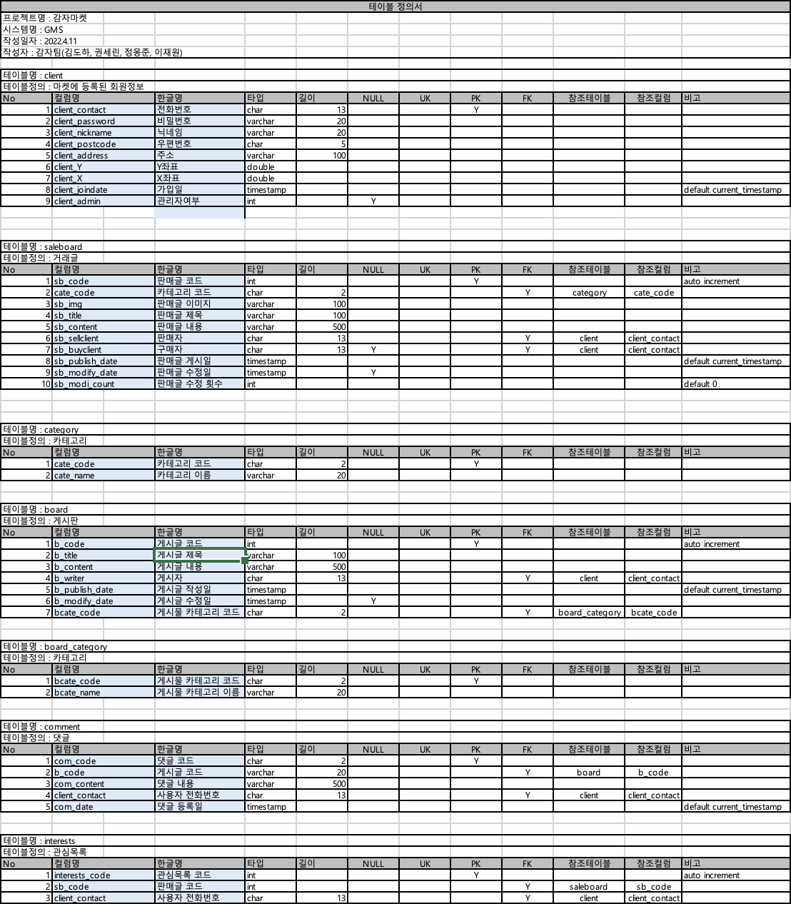

#### ERD
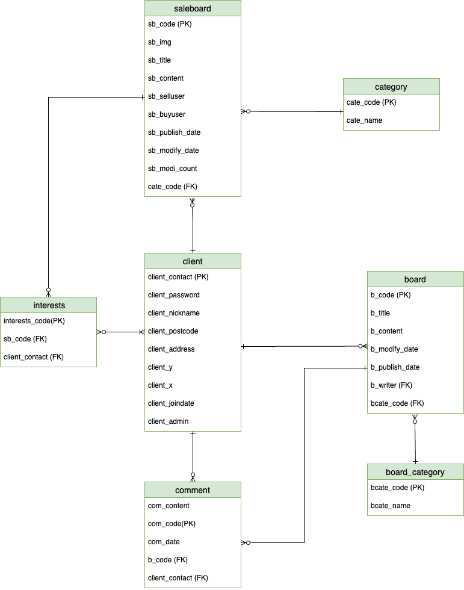

#### 기능 소개

메인 페이지 : 로그인 시 회원의 지역을 활용해 근처 거래(감자)를 확인할 수 있으며, 감자 아이콘을 클릭하여 판매글로 이동할 수 있습니다. 지도를 활용하여 근처에 어떤 상품이 판매되고 있는지 확인하고, 원하는 지역에서의 거래를 간편하게 찾아보세요. 메인페이지 하단에서는 인기 판매글과 게시글을 볼 수 있습니다.

**메인페이지**

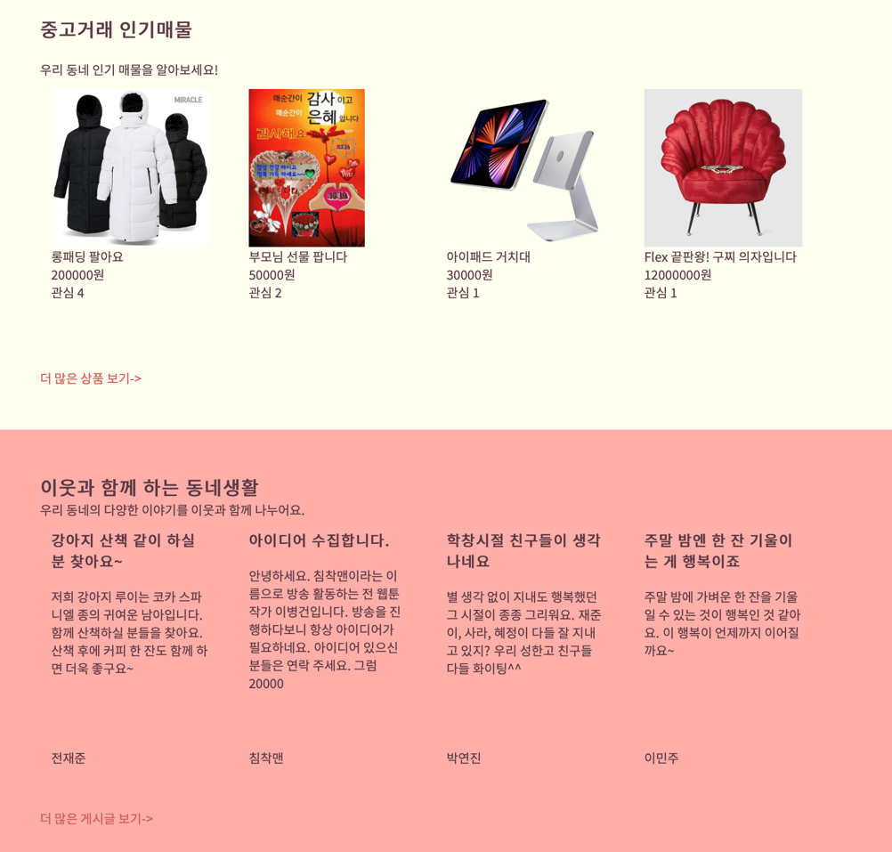

게시글 작성 기능: 중고 거래와 일반 게시글을 작성할 수 있으며, 댓글 작성을 통해 소통의 창구를 열어 더 많은 정보를 주고받을 수 있습니다. 판매글은 좋아요를 받을 수 있으며 집계가 가능합니다.

**판매글 작성 예시**
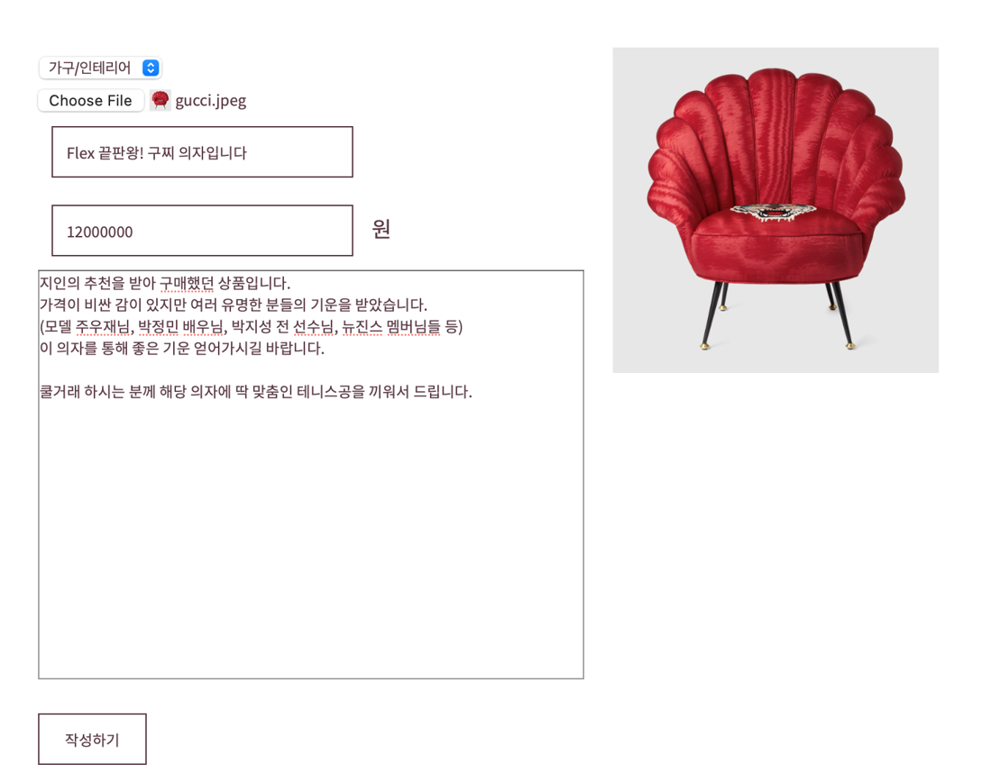

**판매글의 좋아요 버튼**
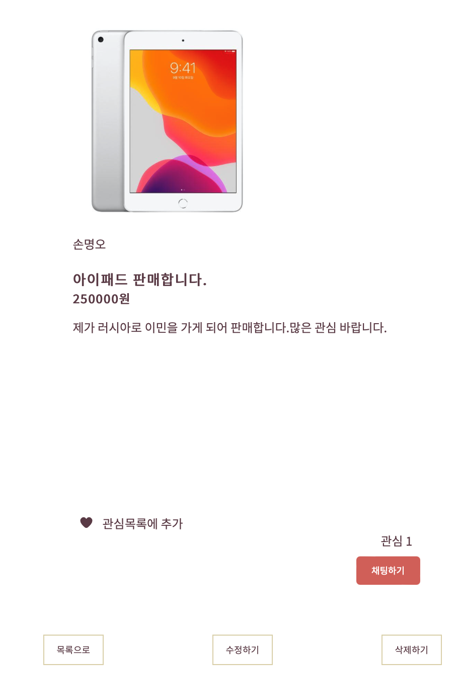

**게시판 화면**
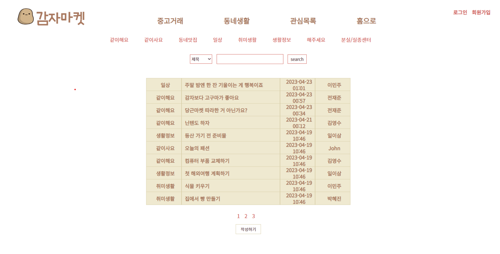

**게시글 작성 예시**
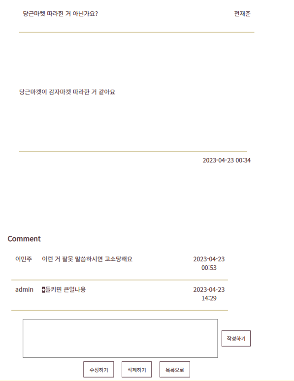

1:1 채팅 기능: 실시간으로 판매자와 소통하고 싶다면 1:1 채팅 기능을 활용하세요. 채팅이 오면 사이트 상단 네비게이션 및 채팅 목록에 알림이 옵니다.

**채팅 알람 예시**
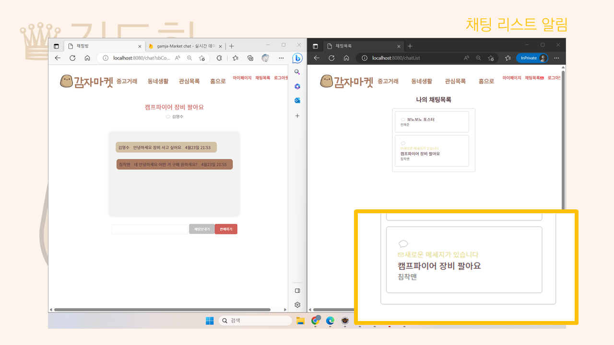
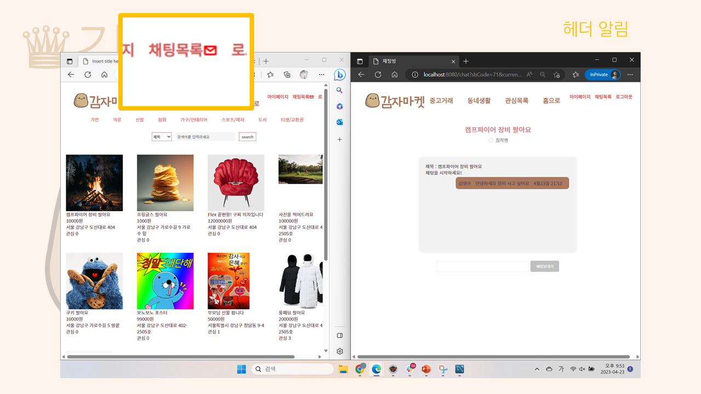

**채팅 예시**
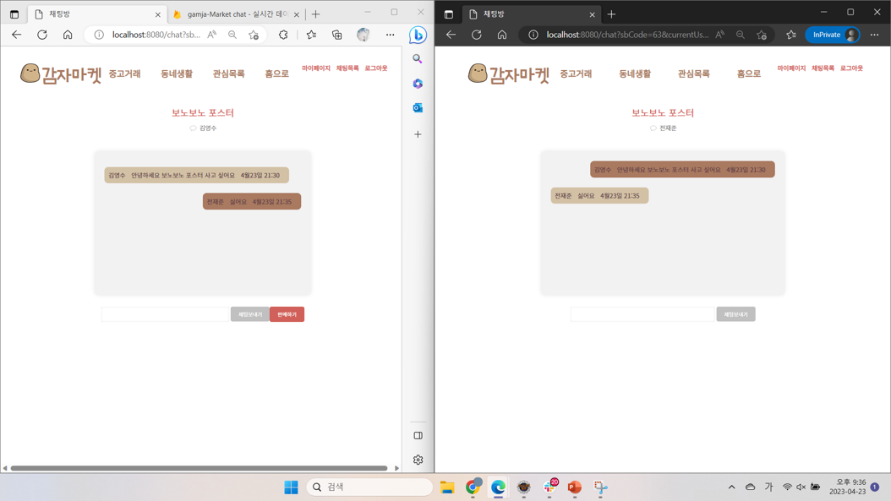

관리자 모드: 사이트의 건전한 운영을 위해 관리자 모드를 도입했습니다. 중고 거래 게시물, 일반 게시글, 댓글에 대한 관리가 가능하여 사용자들 간의 안전하고 건전한 소통을 지원합니다.

**관리자 모드**
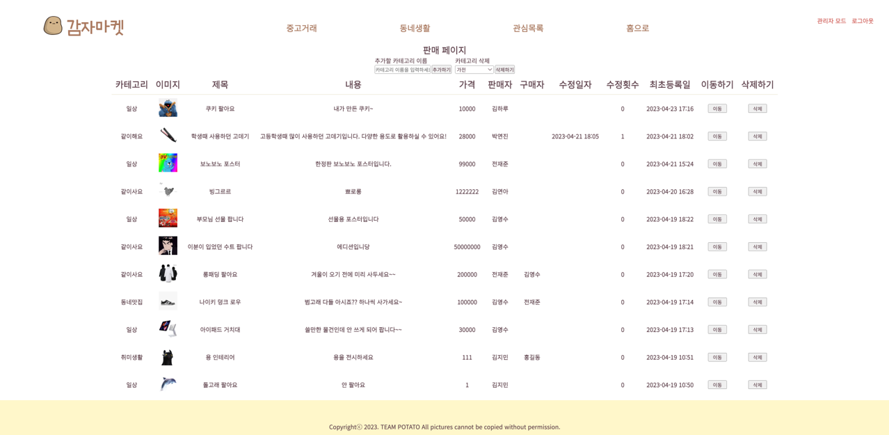

